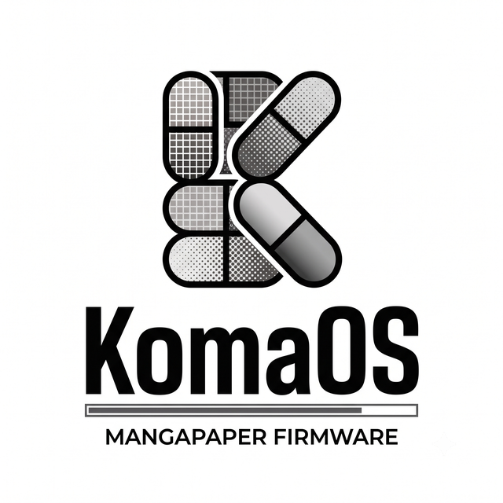
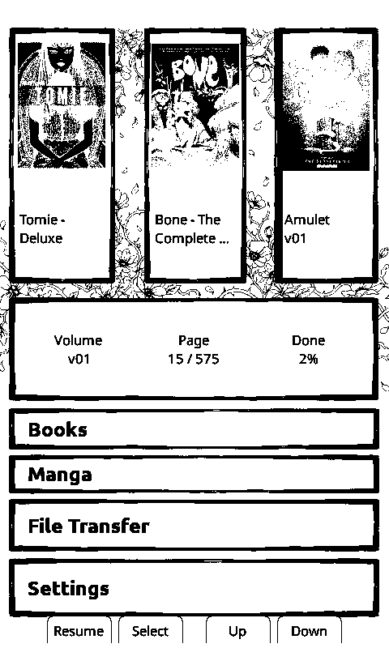
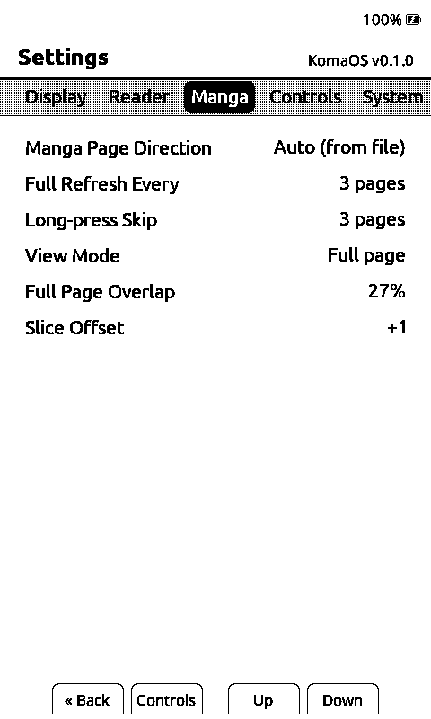
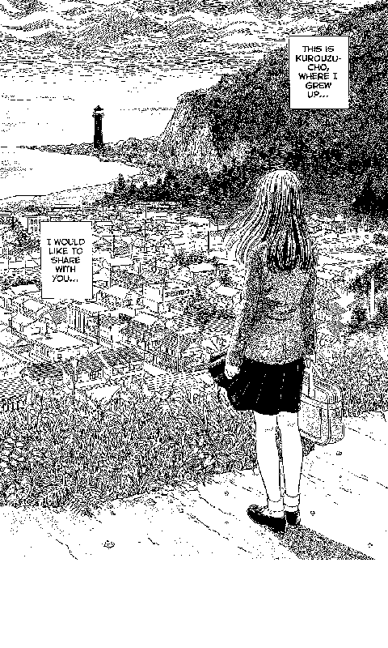
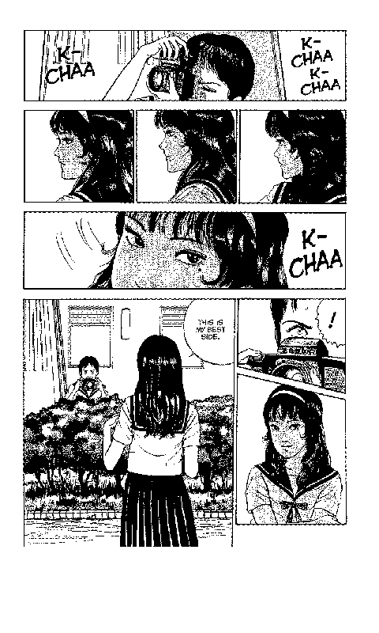
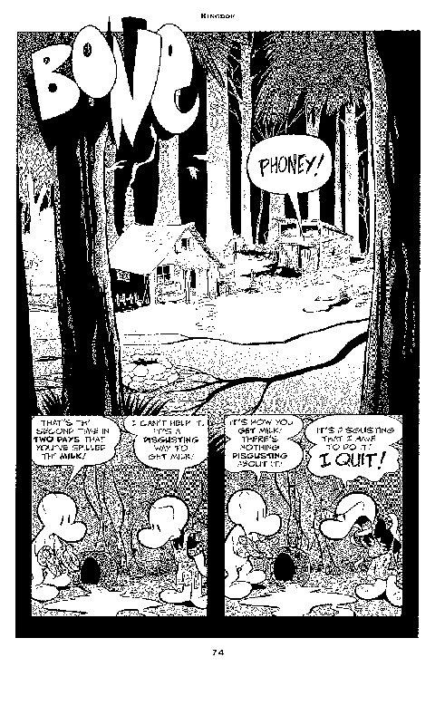

<div align="center">



### Manga-first e-reader firmware for ESP32-C3 Xteink devices

*Koma* (コマ) is the Japanese word for a manga panel.

[](https://github.com/0xKnowles/KomaOS/actions/workflows/ci.yml)
[](LICENSE)
[](https://www.espressif.com/en/products/socs/esp32-c3)
[](https://www.xteink.com/)



</div>

---

## What it is

KomaOS keeps everything that makes [CrossPoint Reader](https://github.com/crosspoint-reader/crosspoint-reader)
a good EPUB reader and builds the missing half on top of it: fast paged-image reading, volume-aware
libraries, and a comic pipeline that starts at a CBZ on your NAS and ends at a page on the panel.

The ESP32-C3 cannot decode a full-resolution JPEG per page turn inside a 380 KB RAM budget. So KomaOS
does not try. Pages are pre-rendered off-device into **XTC/XTCH** — 1-bit or 2-bit grayscale at panel
resolution — and a page turn costs a decode-free blit.

<div align="center">



</div>

<div align="center">

</div>
<div align="center">

</div>
## Highlights

| | |
|---|---|
| **Manga reader** | Split and full-page view modes, reading-direction control (LTR/RTL, or from the file), quick page jump, per-volume bookmarks, chapter selection |
| **Manga menu** | One press from the page: jump, bookmark, view mode, orientation, screenshot, reader settings |
| **Status bar** | Bottom, top, or a vertical column down the right edge for landscape reading — with glyphs turned to match pre-rotated artwork |
| **KomaUI theme** | A home screen laid out as manga panels: hero cover, recent volumes, reading stats |
| **Full reader engine** | EPUB 2/3, `.txt`, `.bmp`, hyphenation, kerning, footnotes, dictionary lookups ([StarDict](docs/dictionary.md)), focus reading, KOReader sync |
| **Wireless** | Wi-Fi transfer, OPDS browsing, Calibre wireless, OTA updates |

## Getting manga onto the device

CBZ and CBR are converted to XTC on a real computer, not on the device.

- **[FlipNzb](https://github.com/0xKnowles/FlipNzb)** — monitors mangaka, grabs volumes from your
  indexers, and converts the result to XTC in place (Media Management → Conversion). Contrast stretch,
  sharpen, serpentine Floyd–Steinberg dithering and the overlapping-strip layout are all tunable.
- **[xtcjs](https://github.com/varo6/xtcjs)** — a browser tool for one-off conversions.

A tall manga page is split into overlapping strips so no panel is cut in half across a page turn.
**Full page** view reassembles those strips on the device, cropping the overlap so nothing is drawn
twice. It is necessarily softer than reading the strips — it re-dithers art that was already
dithered — so it works best as an orientation view rather than a reading view.

## Hardware

| | |
|---|---|
| **MCU** | ESP32-C3, single-core RISC-V @ 160 MHz |
| **RAM** | ~380 KB usable, no PSRAM |
| **Flash** | 16 MB |
| **Display** | 800×480 e-ink (X4) / 792×528 (X3), 48 KB single framebuffer |
| **Storage** | SD card, with an aggressive on-card cache under `/.komaos/` |

One firmware binary covers both devices; the hardware is detected at runtime.

## Install

> **Coming from CrossPoint Reader?** KomaOS keeps its SD cache and settings under `/.komaos/`
> instead of `/.crosspoint/`. Rename that folder on the card before first boot and your settings,
> reading progress, bookmarks and parsed-book caches carry over intact. Skip the rename and nothing
> breaks — you just start fresh and re-parse your library.

### Web installer (recommended)

1. Connect the device over USB-C, then wake and unlock it.
2. Go to [crosspointreader.com/#flash-tools](https://crosspointreader.com/#flash-tools), select your
   device (X3 or X4), and choose an official KomaOS release.

To flash a specific build, download a `firmware.bin` from
[Releases](https://github.com/0xKnowles/KomaOS/releases) or a CI artifact, then choose **Custom .bin**.

### Command line

```bash
pip install esptool
esptool --chip esp32c3 --port /dev/ttyACM0 write-flash 0x0 firmware.bin
```

Reverting to stock firmware uses the same flash tool.

## Build from source

```bash
git clone --recursive https://github.com/0xKnowles/KomaOS.git
cd KomaOS
pio run                 # build
pio run -t upload       # build and flash
pio device monitor      # serial log
```

If you cloned without `--recursive`: `git submodule update --init --recursive`.

Requires [PlatformIO](https://platformio.org/). Before opening a PR, run `./bin/clang-format-fix`
and `pio check` — CI enforces both, alongside the host test suite (`cmake -S test -B build && ctest`).

## Documentation

| | |
|---|---|
| [Contributing](docs/contributing) | Development setup and conventions |
| [File formats](docs/file-formats.md) | XTC/XTCH, cache layout, on-card structures |
| [Activity manager](docs/activity-manager.md) | The UI lifecycle everything is built on |
| [Dictionary](docs/dictionary.md) | StarDict setup |
| [SD-card fonts](docs/sd-card-fonts.md) | Installing custom fonts |
| [i18n](docs/i18n.md) | Adding or editing translations |
| [Unbricking](docs/fix-bricked-xteink.md) | Recovery for a USB-locked device |

## Relationship to CrossPoint Reader

KomaOS is a friendly fork of [crosspoint-reader](https://github.com/crosspoint-reader/crosspoint-reader)
by Dave Allie and contributors, MIT licensed, with full history preserved. Upstream fixes are merged in
regularly, and everything upstream does still works here — KomaOS adds the manga layer rather than
replacing the reader.

**Bugs in shared code are best reported upstream. Bugs in anything manga-specific belong here.**

## License

MIT — see [LICENSE](LICENSE). Original work © Dave Allie and CrossPoint Reader contributors.
